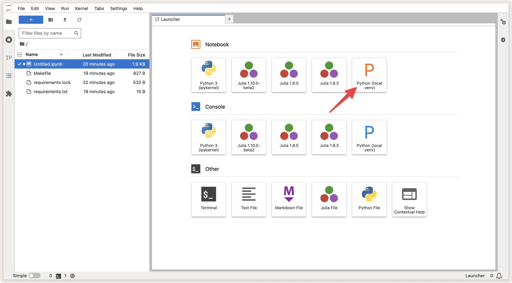
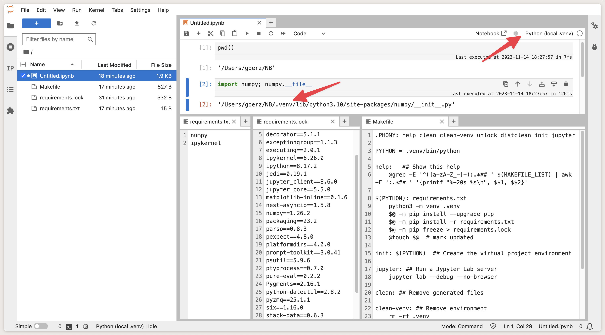

# Python Local `.venv` Kernel

[](https://github.com/goerz/python-localvenv-kernel)
[](https://pypi.org/project/python-localvenv-kernel/)
[](https://anaconda.org/conda-forge/python-localvenv-kernel)
[](https://github.com/conda-forge/python-localvenv-kernel-feedstock)
[](https://opensource.org/licenses/MIT)

A Jupyter kernel that delegates to `ipykernel` in the `.venv` environment of a project folder.

Derived from [`poetry-kernel`](https://github.com/pathbird/poetry-kernel), see the [FAQ](https://github.com/goerz/python-localvenv-kernel/blob/master/FAQ.md).


## Installation

The `python-localvenv-kernel` package must be installed into the same environment as Jupyter itself.

```
pip install python-localvenv-kernel
```

```
conda install python-localvenv-kernel
```


## Usage

* Jupyter and the `python-localvenv-kernel` package should be installed in the same environment
* The project folder must have a virtual (project) environment instantiated in a subfolder `.venv`
* The project environment must include the `ipykernel` package (but not `jupyter`)
* Start Jupyter from the project folder
* Select the "Python (local .venv)" kernel






## FAQ

[See `FAQ.md`.](https://github.com/goerz/python-localvenv-kernel/blob/master/FAQ.md)
